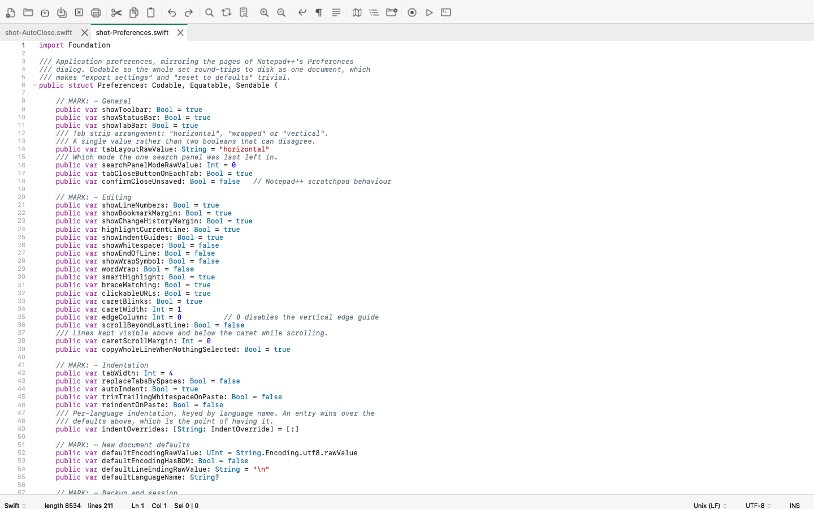
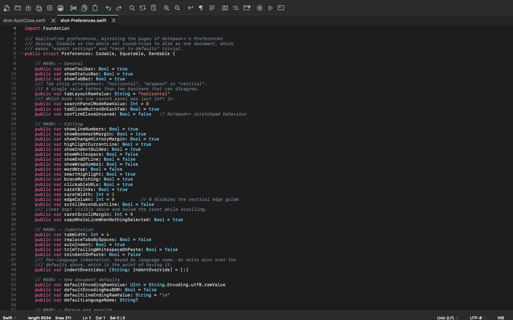
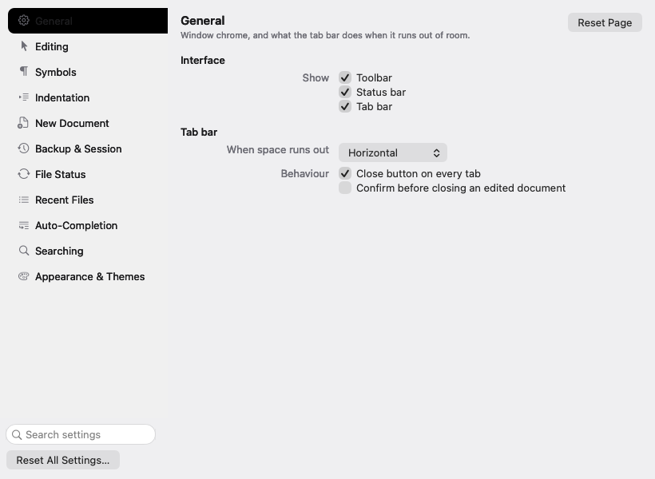

# NotepadXX


Notepad++ for macOS. Native Swift/AppKit, MIT licensed.

Not a "Mac editor inspired by Notepad++" — the goal is functional parity. The
matrices in `docs/parity/` enumerate **~884 user-visible commands** from the
Notepad++ manual and source; the project is done when each is implemented or has
a documented OS-level reason to differ.



<details>
<summary>Dark appearance, and Preferences</summary>





</details>

## Download

[**NotepadXX**](https://github.com/Chanclatoen/NotepadXX/releases/latest)
— macOS 14+, Apple Silicon and Intel.

The build is signed with a Developer ID but not yet notarized, so macOS refuses
it on first launch: right-click the app and choose **Open**, or run
`xattr -d com.apple.quarantine /Applications/NotepadXX.app`. The signature
itself is valid — `codesign --verify --strict` passes.

## Why this exists

macOS has good editors, but nothing combines what Notepad++ users actually rely
on: native and instant-launching, a scratchpad you can trust with unsaved work,
real rectangular/column selection, find-in-files with a clickable results tree,
and GUI-authored custom syntax highlighting — free, with no nag screens.

## Status

Working editor, not yet at parity. 786 tests, all passing on CI. Implemented
and verified:

- Tabs, open/save/save-as/save-all/close, CLI open at `file:line:column`
- Session restore including **crash-safe unsaved buffers** — untitled scratch
  buffers survive `kill -9` and come back with no save prompt
- Syntax highlighting for 96 languages, folding, Function List, autocomplete with call tips
- Column mode with the Column Editor, bookmarks, brace matching
- Find/Replace, Find in Files with a clickable results panel
- Split view, Document Map, Folder as Workspace, Clipboard History
- Macros, Run menu, Preferences, themes, Shortcut Mapper
- A JavaScript plugin system with Plugins Admin (see `docs/PLUGINS.md`)
- Encoding/BOM handling with Notepad++'s "Convert to" vs "Encode in" split
- Large-file performance validated (see below)

## Interface

The window is built from a design system rather than ad-hoc values: one set of
tokens for colour, spacing, type and motion, resolved per appearance, with the
components (toolbar, tab strip, status bar, panel headers, state banners) built
on top. Every token is pinned by test to the value the design specifies, in both
light and dark, and nothing outside the design module reaches for a system
colour.

What that buys, concretely:

- Three real tab layouts — a scrolling strip with edge chevrons and a document
  list, genuine wrapped rows, and a vertical side rail beside the editor
- A toolbar that sheds whole groups into an overflow menu as the window narrows,
  and a status bar that collapses in stages rather than truncating
- One search surface: Find, Replace, Find in Files and Mark are four modes of a
  single non-activating panel, with results docked and grouped by file
- Preferences as eleven pages with a live search over every setting
- Prompts about a document appear as sheets on that document's window; command
  dialogs are modeless and remember their values
- Signals never rest on hue alone: the five mark styles differ in form, and the
  change-history lane uses a square for unsaved and a rounded bar for saved

Every feature category in the parity matrices now has a working
implementation. See `docs/ROADMAP.md` for the remaining detail.

## Performance

Reproduce these rather than trust them:

```sh
swift build -c release
./.build/release/NotepadXX --benchmark /path/to/large-file --no-session
```

Measured on an Apple M4, release build, on a 100 MB log of 1,120,754 lines:

| operation | result |
|---|---|
| open (read 1,730 ms + build the view 684 ms) | **2.4 s** |
| edit (insert at the start) | 395 ms |
| scroll to the bottom | 307 ms |
| resident memory | 875 MB |

A 60 MB C source file, which has block comments and so cannot skip the lexer
state scan, opens in 1.6 s and scrolls to the bottom in 806 ms.

Known limits: memory is several times the file size, so multi-GB files are not
supported. Reading the file is now the largest part of opening it. Documents
consisting of one multi-megabyte line cost ~65-80 ms per edit.

## Building

Requires macOS 14+ and Swift 6.

```sh
./scripts/check.sh      # lint, debug and release builds, the whole test suite
./scripts/make-app.sh   # produces dist/NotepadXX.app
./scripts/release.sh    # signs and packages dist/NotepadXX.dmg
```

CI runs on a self-hosted runner — this repository's own Mac — rather than
GitHub-hosted machines, which are billed. Nothing runs in the background: start
the runner when you want the queued jobs picked up.

```sh
./scripts/ci-local.sh           # take one queued job, then exit
./scripts/ci-local.sh --watch   # keep taking jobs until Ctrl-C
```

Pushing without starting it is fine: the jobs queue until the runner appears,
and the pre-push hook has already built and tested locally. Pull requests from
forks are refused on the self-hosted runner, because a fork's code would
otherwise execute on that machine.

`check.sh` is what CI runs. `release.sh` signs with a Developer ID from the
keychain and stops before notarization unless notary credentials are set, so a
build is never described as more blessed than it is.

## Security

Every push runs Semgrep, a full-history secret scan, and a check that the built
app still has the hardened runtime and has gained no entitlement that weakens
it. `.semgrep.yml` holds rules aimed at this program's own hazards rather than
generic ones: the Run menu's shell invocation, the JavaScript plug-in bridge,
and the plug-in catalogue it downloads from.

Two things are worth knowing if you are reviewing it:

- **Run commands go to a shell**, because they are written by the user and are
  expected to support pipes and redirection. Substituted values — paths, file
  names, the current word — are shell-quoted, so a file called
  `notes; rm -rf ~ .txt` cannot become a second command. `ShellInjectionTests`
  proves this by running a hostile name through a real shell.
- **Plug-ins are JavaScript with a nine-function bridge** — get and set text,
  selection, path, document count, and a message. JavaScriptCore has no file,
  network or process access of its own, so that list is the whole capability
  set. Archives are fetched over HTTPS only and checked against a SHA-256 from
  the catalogue; plain HTTP is refused, because an attacker who can rewrite the
  catalogue in transit would supply the hash as well.

## Documentation

- `docs/ARCHITECTURE.md` — engine choice, the performance rule, rejected
  dependencies and why
- `scripts/make-icon.swift` — the app icon, drawn from the design tokens rather
  than kept as a binary blob, and simplified at small sizes
- `docs/parity/` — the full Notepad++ command matrices
- `docs/ROADMAP.md` — order of work

## License

MIT. See `LICENSE`.
